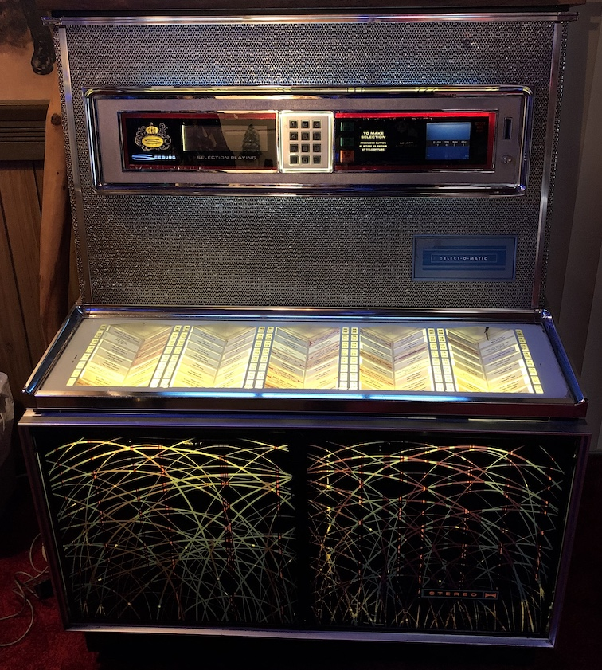
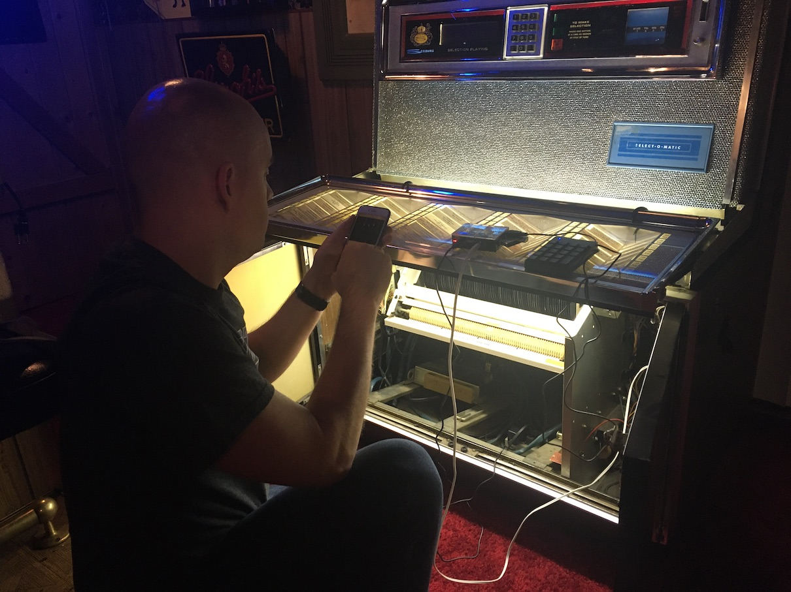
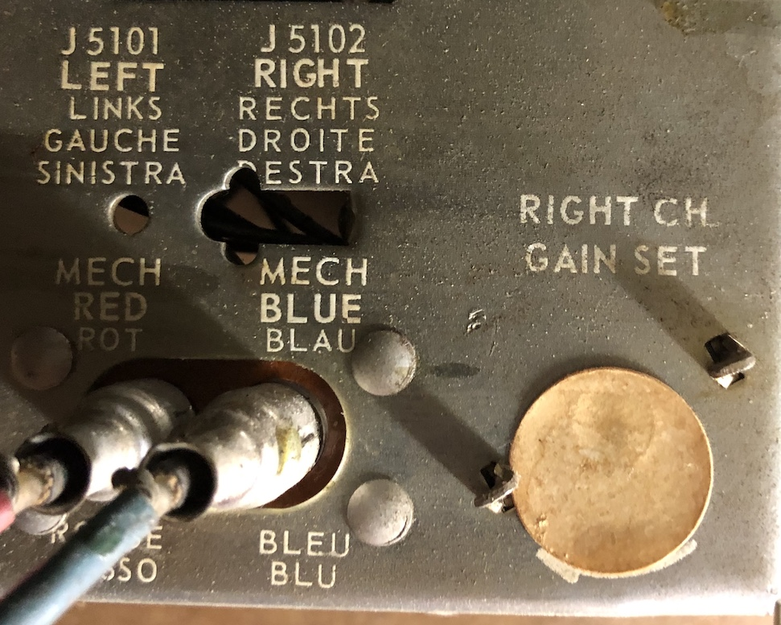

# Pi Jukebox

This project seeks to replace the internals of a 1960s Seeburg Select-o-matic LS325 using a Raspberry Pi.

I am documenting this process mostly for my own reference.  If you have clarifying questions, I'd love to answer them through this repository.

Ingredients:

* Seeburg Select-o-matic LS325
* Raspberry Pi 3 with 8+ GB SD card
* Numeric keypad (USB)
* External drive (USB) for song storage (optional)
* Audio cable - 3.5mm to red/white RCA jacks

## Project philosophy

My father-in-law has a 1960s-era Seeburg jukebox that plays 45s (vinyl) but has been in disrepair on and off over the past few years.  I wanted to attempt to replace the moving internal mechanisms with a fully digital system.  I didn't want to actually remove or damage anything that would change the potential value of the jukebox.

I was worried about internet access based on the location.  I wanted a self-contained system that could operate without internet if needed.  This didn't mean that I couldn't use the internet but I didn't want it to be critical to operation.

The jukebox itself doesn't have much of a user interface.  There is a 11 key keypad (0 through 9 plus two idential RESET buttons) for input.  I replicate this with a numeric keypad which has a couple extra keys and a NUMLOCK light.  For output, the jukebox has a "currently playing" numeric output, three lights for the three digits you have entered, and some coin-related lights and slots (all of which I am ignoring for this project).

I am familiar with Python and I had an extra Raspberry Pi.  I decided to find a Raspberry Pi-friendly linux distribution that could run Python3.

I tried Pi Musicbox, but was discouraged by the older packages that were installed.  Then I tried just running MPD (Music Player Daemon) on a Raspbian Lite (Buster) but that required more tweaking and tuning than I wanted.

I landed on the Moode distribution which is Raspberry Pi-friendly and is also Python3-based.

## Overall Setup

### Hardware

The Raspberry Pi goes inside the main jukebox cabinet.  It is plugged into "Night Light" power, which keeps it powered all the time.  I could have plugged the Pi into a switched outlet because the system boots in about 45 seconds but I didn't want to have to worry about ungraceful shutdowns.

The audio output is connected to the amplifier input with the 3.5mm to RCA cable.  A view of the amplifier RCA inputs:

### Software

Moode is installed as the operating system for the Pi.  The system automatically logs in and runs a startup script.  The startup script repeated re-runs the [python glue code](src/jukebox.py) until it exits with a 0 exit code.

## Install Moode

The distribution is a bit weird to setup because it's intended to be totally headless.  Follow the steps on <http://moodeaudio.org/>

### Configuration

Here are the settings I changed while setting up Moode.  These are mostly for my own reference.

#### Network Config

* SSID
* Password
* Country - United States

#### Library Config

* Automatically update MPD database on USB insert/remove - YES

#### Audio Config

* MPD
  * Autoplay after start - ON

#### System Config

##### General

* Timezone - America/Los_Angeles
* Browser Title - Jukebox

##### System Modifications

* HDMI port - ON
* File system - Expand

##### Local Display

* Local UI display - ON

##### Local Services

* SSH term server - ON

Reboot after all settings are changed

#### Random configuration required

* To use the 3.5mm jack run `sudo raspi-config` and set "Audio Output" to "Force 3.5mm"
* Prevent the blank screen from popping up.  Edit `/home/pi/.xinitrc` and comment out the line starting with `chromium-browser`
* Turn on HDMI display by editing `sudo nano /boot/config.txt` and commenting out the `hdmi_blanking` line.
* Configure startup settings to autologin to console:
<https://www.opentechguides.com/how-to/article/raspberry-pi/134/raspbian-jessie-autologin.html>
* Run `setup.sh` to install prequisites and set up the autorunning of the `jukebox.py`.
* I also installed `mpc`, a command-line tool for working with MPD via `pip3 install mpc`

## Music

### Add music

Put music on a USB key or the SDCARD itself, you may have to rescan in MPD to pick up the new songs.  Music should be prefixed with three digits and a dash `###-Song name.mp3`.

### Add radio stations

Add local radio stations using the web interface.  Name the radio stations `###-Station name`.  You can use 3 or 4 digits for the station.

## Use

To queue up a song, just type the three-digit number prefixed to the song name.

To play radio stations, start with 9, then the 3-4 digit station number.  Playing a station will delete the queue.  Adding a song to the queue will stop the radio station and immediately start the song.

### Controls

* Skip - `/` or `s`
* Increase volume - `+`
* Decrease volume - `-`
* Delete last number you typed - `BACKSPACE`
* Clear/reset all you've typed - `ENTER` or `r`
* Re-initialize everything - `i`
* Quit - `q`

### Random play

Entering `777` will start random play mode.  Basically every song that is not currently on the queue will be added to the queue randomly.  This is great if you don't want to pick out songs and just want to listen to your music.  To turn off random play, enqueue any song.  This will clear everything off the queue except the currently playing song, turning random play off without disrupting the current song.

### Startup song

When you start the jukebox system up and there is nothing in the queue, the startup song will be played.  To create a startup song, just prefix the song with `STARTUP_SONG` as the number. See line 33 of [jukebox.py](src/jukebox.py).

## Future improvements

Currently the system relies on a USB numeric keypad.  In the future, I'd like to use the actual buttons on the jukebox for input and the lighting system for the display, which will require using the general purpose input/output (GPIO) pins on the Pi.

## References

[MPD protocol documentation](https://www.musicpd.org/doc/html/protocol.html)

[Python module for running MPD (mpd2)](https://python-mpd2.readthedocs.io/)

I started my research with this article [Extending the Raspberry Pi to a miniature music center](http://www.raspberry-pi-geek.com/Archive/2013/01/Extending-the-Raspberry-Pi-to-a-miniature-music-center)

[How to emulate Raspberry Pi on Mac](https://grantwinney.com/how-to-create-a-raspberry-pi-virtual-machine-vm-in-virtualbox/)

[Debian - Install Sudo](https://www.privateinternetaccess.com/forum/discussion/18063/debian-8-1-0-jessie-sudo-fix-not-installed-by-default)

## Using the GPIO pins

[gpiozero](https://gpiozero.readthedocs.io/en/stable/api_pins.html#module-gpiozero.pins.native)

[Mocking GPIO](https://github.com/grantwinney/52-Weeks-of-Pi/blob/master/GPIOmock.py)

[GPIO](https://sourceforge.net/projects/raspberry-gpio-python/)
